## Figures

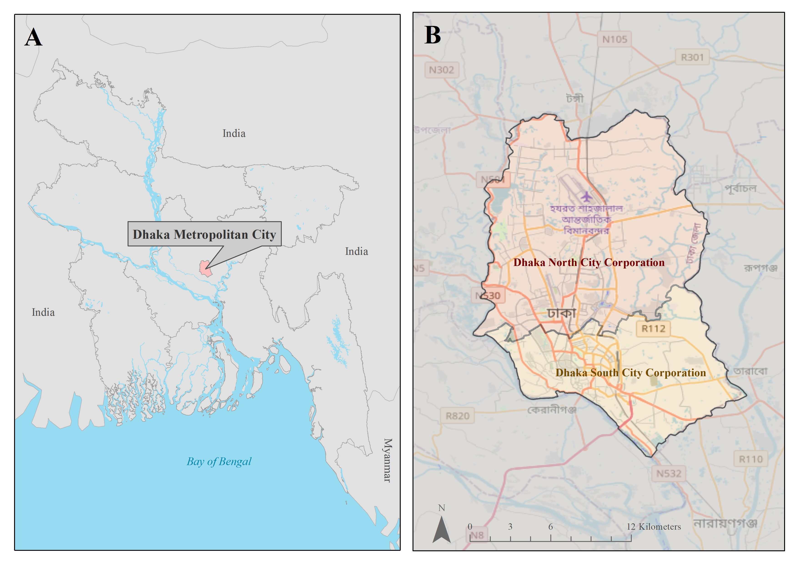

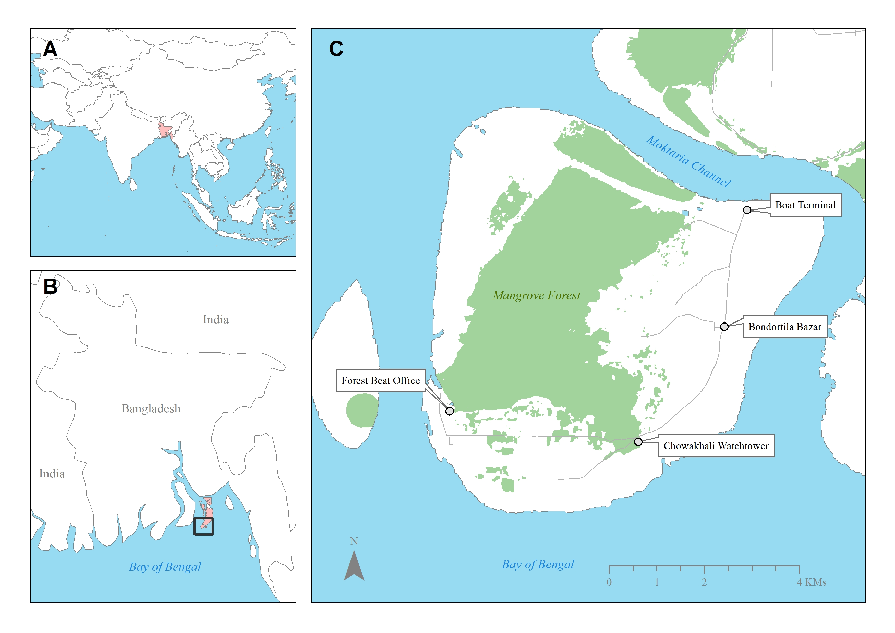

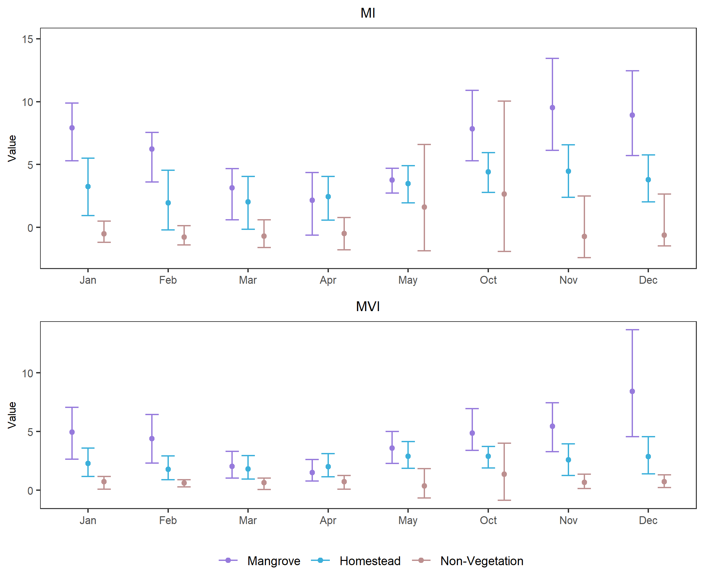

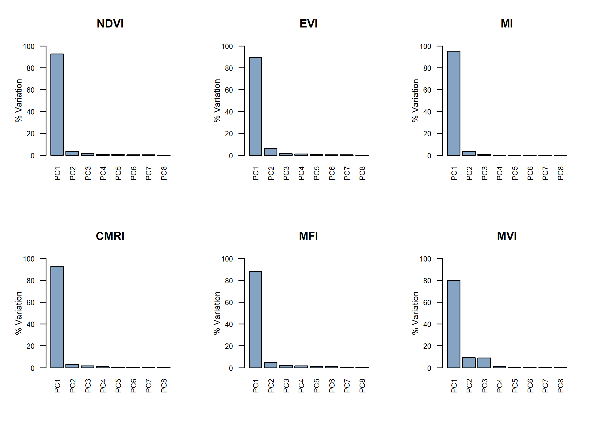

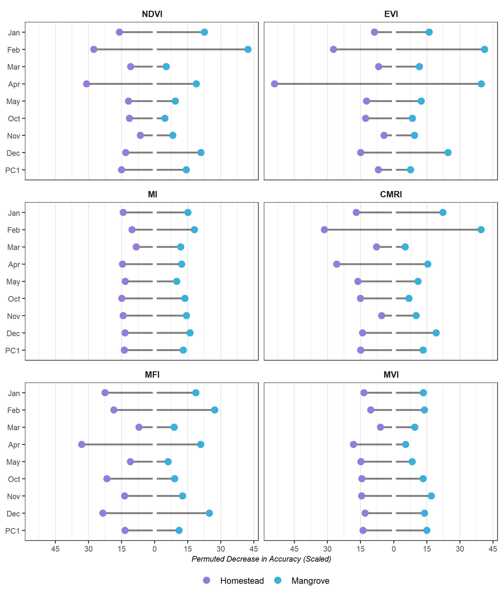

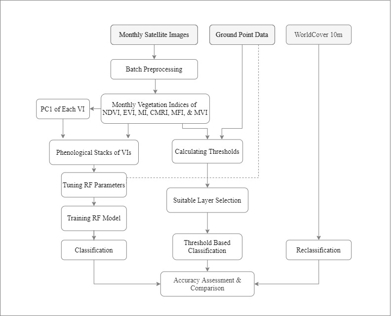

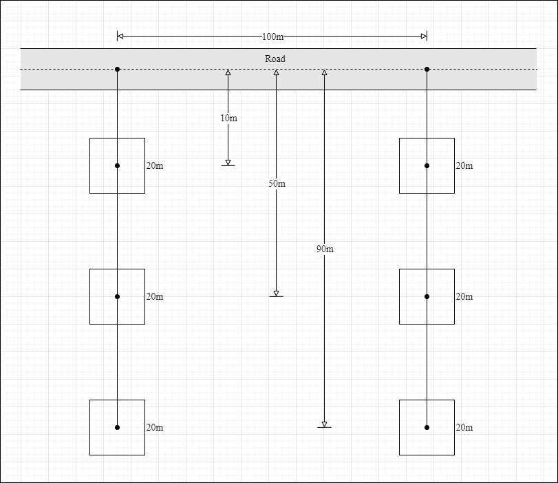

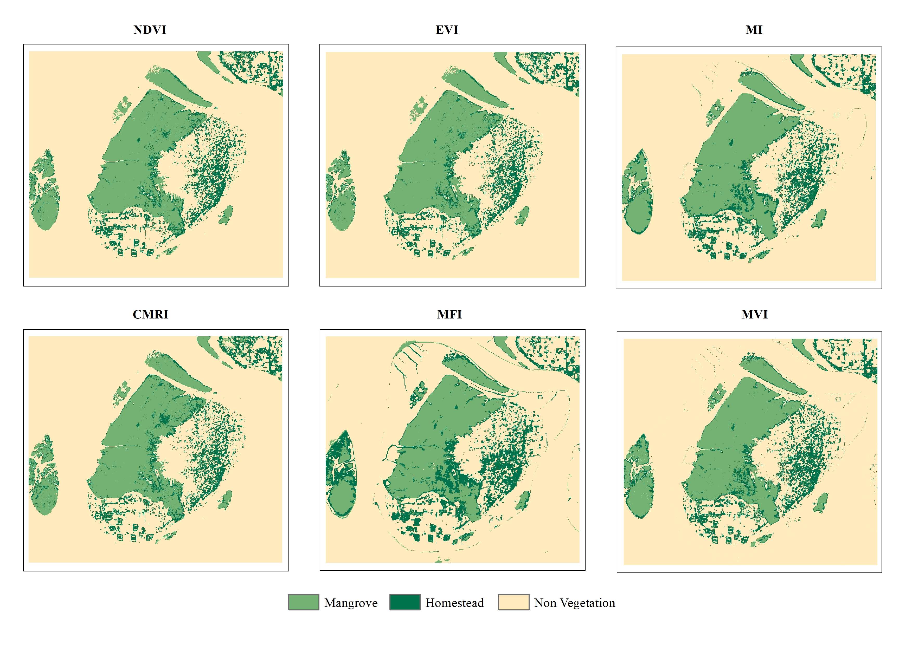

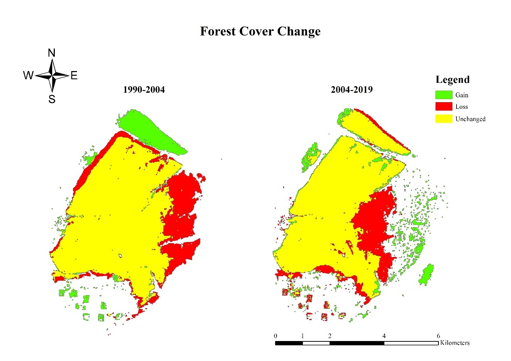

## Artworks

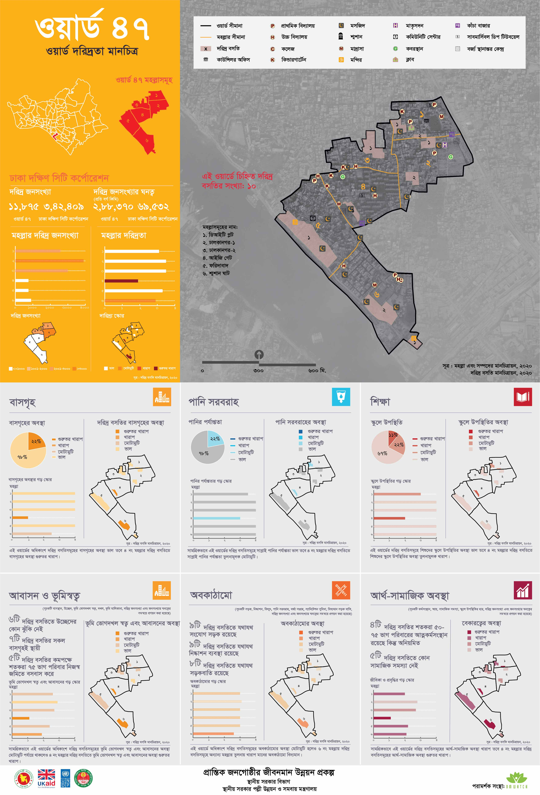

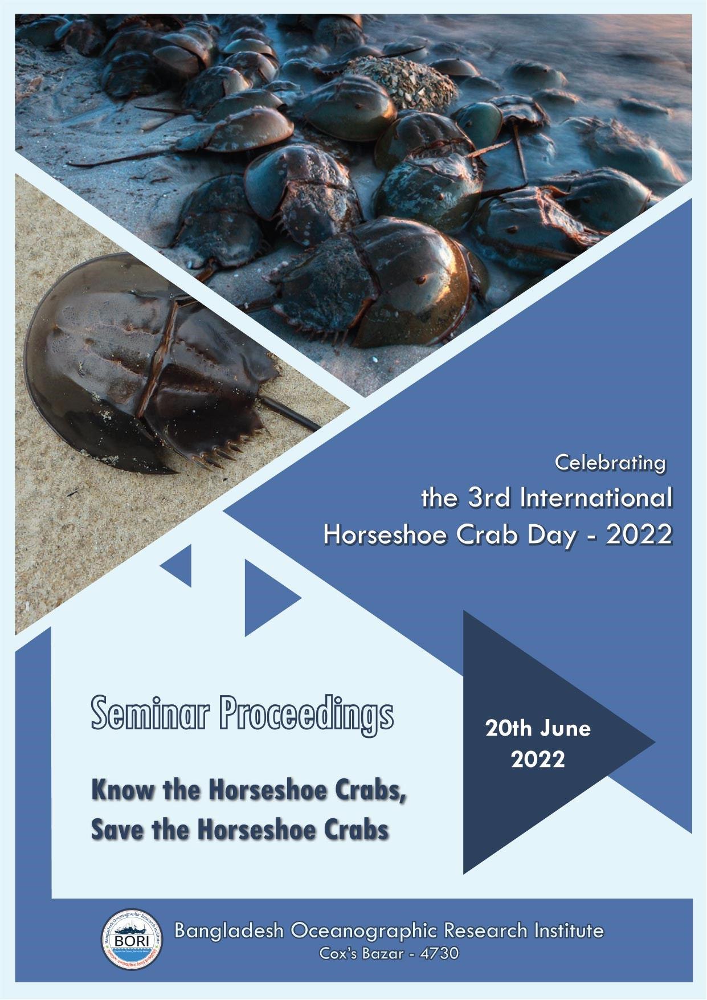

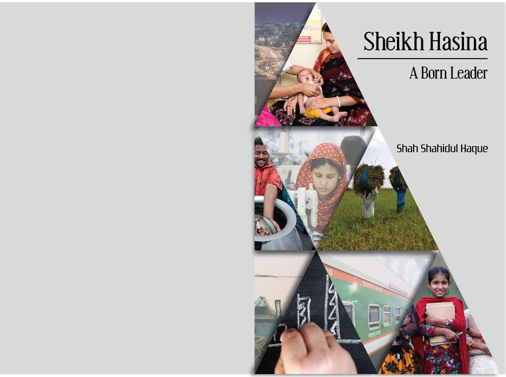

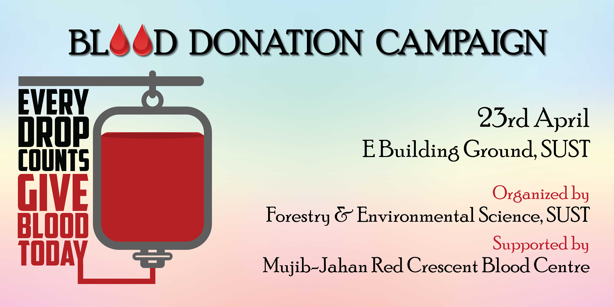

### Links
[ResearchGate](https://www.researchgate.net/profile/Sultan-Mahmud-7)  
[LinkedIn](https://linkedin.com/in/sultan-mahmud-sust/)  
[Github](https://github.com/sultan-in-gh)  
